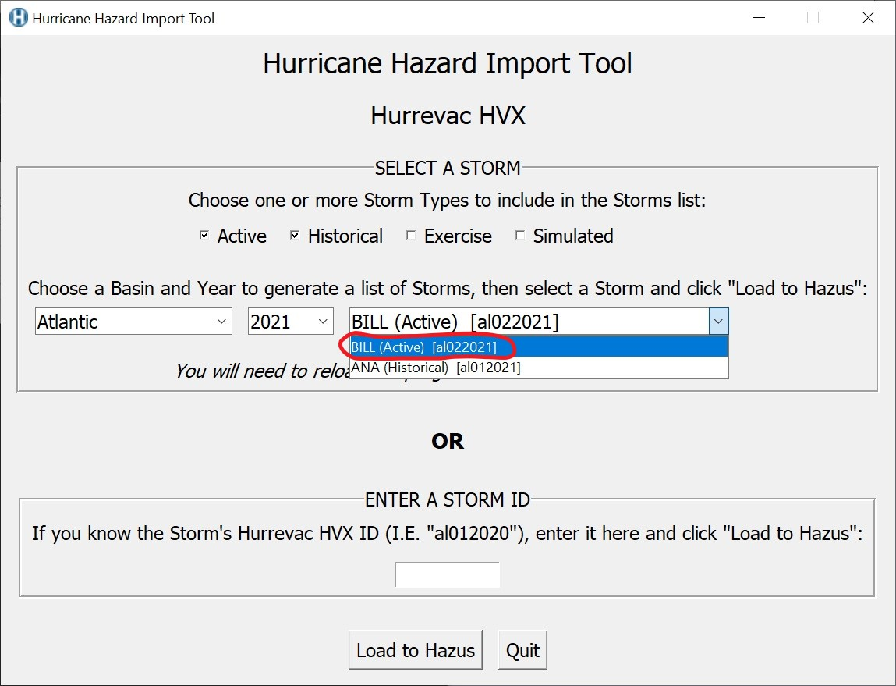

# Hurricane Hazard Import Tool (HHIT)
The Hurricane Hazard Import Tool (HHIT) downloads, prepares, and imports Hurrevac hurricane data into a user's local Hazus database for hurricane loss modeling. Hurrevac is a storm tracking decision support tool jointly developed by the Federal Emergency Management Agency, the U.S. Army Corps of Engineers, and the National Oceanic and Atmospheric Administration. Hurrevac storm data include the location, direction, and speed of tropical storm winds for previous, current, and forecasted storm information produced by NOAA's National Hurricane Center advisories. Learn more about Hurrevac here: http://www.hurrevac.com/ 

## Requirements

The HHIT requires Hazus, conda, and an active internet connection. Follow the [README](https://github.com/nhrap-hazus/Environment-Setup) to setup your machine with miniforge and conda before running HHIT.

## To Use

**1. Download zip folder of tool from GitHub, then unzip**

 

 

**2. Double-click "hurricane-hazard-import-tool.py".** 

 

**3. Select a combination of storm type, basin, and year to see a list of available storms. Select a storm from the drop down list.**

**4. Alternatively, if you know the Hurrevac storm ID, enter it in the entry box.**

**5. Click the 'Load to Hazus' button to load data for your chosen storm to your Hazus database.**

**6. In Hazus, please build or open an existing region impacted by your selected storm and:**
   1. Select “{huScenarioName}”
   2. Choose “Edit” so that Hazus will check and validate imported Hurrevac data.
   3. Select "Next" and proceed through the Hazus wizard until a new scenario for your selected storm is saved.

## Troubleshooting

Please reach out to the Hazus Team any time for help troubleshooting tool issues at fema-hazus-support@fema.dhs.gov.

Install and Uninstall directions can be found [here](https://github.com/nhrap-dev/Environment-Setup/tree/update-README).

## Documentation

- Note that if a new storm is activated while the HHIT is open, you will need to close/quit the tool and reopen it to see the new storm in the drop down list.

Customization (for advanced users comfortable editing JSON):
- The default settings for Storm Type can be changed in the /src/hurrevac_settings.json. Check and uncheck Types.
- The default settings for Storm Basins can be changed in the /src/hurrevac_settings.json. Reorder, add or remove Basins.
- "Optimize Track" truncates head and tail points with wind speeds significantly below tropical storm classification. These points are unnecessary for analysis and their removal increases windfield processing speeds. "Optimize Track" is selected by default.

Hurricane Dorian (2019) optimized storm track; data points in orange portion of track were removed

## Contact

Issues can be reported through the repository on GitHub (https://github.com/nhrap-hazus/HHIT)

For questions: contact fema-hazus-support@fema.dhs.gov
