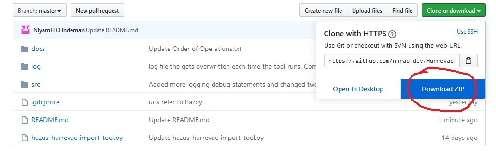

# Hazus Hurrevac Import Tool (HHIT)
The Hazus Hurrevac Import Tool (HHIT) downloads, prepares, and imports Hurrevac hurricane data into a user's local Hazus database for hurricane loss modeling. Hurrevac is a storm tracking decision support tool jointly developed by the Federal Emergency Management Agency, the U.S. Army Corps of Engineers, and the National Oceanic and Atmospheric Administration. Hurrevac storm data include the location, direction, and speed of tropical storm winds. Learn more about Hurrevac here: http://www.hurrevac.com/about.htm 

Launch the HHIT by double-clicking the "hazus-hurrevac-import-tool.py" file in the download folder. The HITT is developed using the Hazus Python Package, HazPy. HazPy tools automatically check for updates each time they are opened. Hazus Python Package documentation is found here: https://github.com/nhrap-hazus/hazus

## Requirements

The HHIT requires Hazus, ArcGIS Desktop, Anaconda, and an active internet connection. Anaconda is a free software that automatically manages Python packages required to run Hazus open source tools, including the Hazus Python package: https://fema-nhrap.s3.amazonaws.com/Hazus/Python/build/html/index.html

1. Go to https://www.anaconda.com/distribution/

2. Download Anaconda for Python 3

3. Complete the installation. During installation, make sure the following options are checked:
   - [x] **Add Anaconda to my PATH environment variable**
   - [x] Register Anaconda as my default Python

## To Use

**Must have Anaconda 3.7 installed. Please read requirements**

**1. Download zip folder of tool from GitHub, unzip**

 

**2. Double-click "hazus-hurrevac-import-tool.py".** If you don't have the Hazus Python Library installed, follow the prompt to install, then double-click "hazus-hurrevac-import-tool.py" again. If you have an older version of the HITT tool, follow the prompt to install, then double-click "hazus-hurrevac-import-tool.py" again

 

**3. Select a combination of storm type, basin, and year to see a list of available storms. Select a storm from the drop down list.**

 

**4. Alternatively, if you know the Hurrevac storm ID, enter it in the entry box.**

**5. Click the 'Load to Hazus' button to load data for your chosen storm to your Hazus database.**

**6. In Hazus, please build or open an existing region impacted by your selected storm and:**
   1. Select “{huScenarioName}”
   2. Choose “Edit” so that Hazus will check and validate imported Hurrevac data.
   3. Select "Next" and proceed through the Hazus wizard until a new scenario for your selected storm is saved.

## Documentation

- Note that if a new storm is activated while the HHIT is open, you will need to close/quit the tool and reopen it to see the new storm in the drop down list.

Customization (for advanced users comfortable editing JSON):
- The default settings for Storm Type can be changed in the /src/hurrevac_settings.json. Check and uncheck Types.
- The default settings for Storm Basins can be changed in the /src/hurrevac_settings.json. Reorder, add or remove basins.
- "Optimize Track" truncates head and tail points with wind speeds significantly below tropical storm classification. These points are unnecessary for analysis and removal increases windfield processing speeds. "Optimize Track" is selected by default.

Hurricane Dorian (2019) optimized storm track

## Contact

Issues can be reported through the repository on Github (https://github.com/nhrap-dev/Hurrevac)

For questions contact hazus-support@riskmapcds.com
