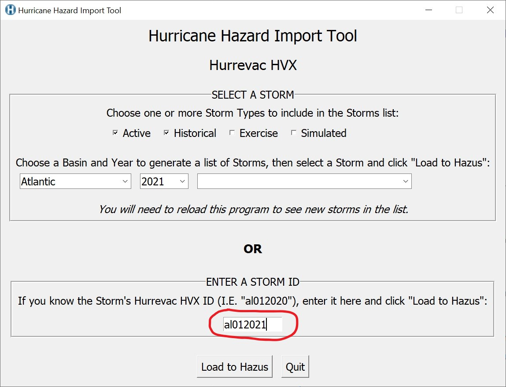

# ATTENTION: The latest version of this tool is available at https://msc.fema.gov/portal/resources/hazus This github repository is no longer receiving updates.

# Hurricane Hazard Import Tool (HHIT)
The Hurricane Hazard Import Tool (HHIT) downloads, prepares, and imports Hurrevac hurricane data into a user's local Hazus database for hurricane loss modeling. Hurrevac is a storm tracking decision support tool jointly developed by the Federal Emergency Management Agency, the U.S. Army Corps of Engineers, and the National Oceanic and Atmospheric Administration. Hurrevac storm data include the location, direction, and speed of tropical storm winds for previous, current, and forecasted storm information produced by NOAA's National Hurricane Center advisories. Learn more about Hurrevac here: http://www.hurrevac.com/ 

Launch the HHIT by double-clicking the "hurricane-hazard-import-tool.py" file in the download folder. The HHIT is developed using the Hazus Python Package, HazPy. HazPy tools automatically check for updates each time they are opened. Hazus Python Package documentation is found here: https://github.com/nhrap-hazus/hazus

## Requirements

The HHIT requires Hazus, ArcGIS Desktop, Anaconda, and an active internet connection. Anaconda is software that automatically manages Python packages required to run Hazus open source tools, including the Hazus Python package.

1. Go to https://www.anaconda.com/distribution/

2. Download Anaconda for Python 3

3. Complete the installation. During installation, make sure the following options are checked:

   - [x] Add Anaconda to my PATH environment variable
   - [x] Register Anaconda as my default Python
   - [x] Install Anaconda for local user, rather than all users

## To Use

**Must have Anaconda with Python 3.8 or higher installed. Please read [requirements](#requirements).**

**1. Download zip folder of tool from GitHub, unzip**

 

 

**2. Double-click "hurricane-hazard-import-tool.py".** If you don't have the Hazus Python Library installed, follow the prompt to install, then double-click "hurricane-hazard-import-tool.py" again. If you have an older version of the HHIT tool, follow the prompt to install, then double-click "hurricane-hazard-import-tool.py" again. If you have a much older version of the HHIT tool or the Hazus Python Library then during the install/update there may be many conflicts and Anaconda will try to resolve them, which can take a long time. If Anaconda is unable to resolve the conflicts, then it is best to use Anaconda to delete the 'hazus_env' environment and then install a fresh Hazus Python Library by double-clicking the "hurricane-hazard-import-tool.py". Please see the Troubleshooting section for step by step instructions.

 

**3. Select a combination of storm type, basin, and year to see a list of available storms. Select a storm from the drop down list.**

**4. Alternatively, if you know the Hurrevac storm ID, enter it in the entry box.**

**5. Click the 'Load to Hazus' button to load data for your chosen storm to your Hazus database.**

**6. In Hazus, please build or open an existing region impacted by your selected storm and:**
   1. Select “{huScenarioName}”
   2. Choose “Edit” so that Hazus will check and validate imported Hurrevac data.
   3. Select "Next" and proceed through the Hazus wizard until a new scenario for your selected storm is saved.

## Troubleshooting

Please reach out to the Hazus Team any time for help troubleshooting tool issues at fema-hazus-support@fema.dhs.gov.

Hazus open source tools use a centrally managed Python environment added to your machine upon installation. If you downloaded and installed HHIT prior to 2021, you may need to delete your old Python environment - called "hazus_env". If you're having issues opening HHIT or if the version number in your "src/__init__.py" file reads '0.0.4' or older, try one of the two options below to delete your old Python environment:

**Using Anaconda:**
1. Delete HHIT from your machine.
2. Open Anaconda.
3. Select the 'hazus_env'.
4. Click the 'Remove' button.
5. A popup will appear asking you to confirm. Click the 'Remove' button. This may take a few minutes.
6. Download the latest HHIT and it will create the hazus_env and install hazpy.

**Using Command Line:**
1. Delete HHIT from your machine.
2. Open a command line prompt
3. Enter the following without qoutes 'conda info --envs' to see your environments. 'hazus_env' should be listed.
4. Enter the following without quotes 'conda env remove --name hazus_env' to remove the environment. This may take a few minutes.
5. Enter the following without qoutes 'conda info --envs' to see your environments again and hazus_env should not be listed.
6. Download the latest HHIT and it will create the hazus_env and install hazpy.

## Documentation

- Note that if a new storm is activated while the HHIT is open, you will need to close/quit the tool and reopen it to see the new storm in the drop down list.

Customization (for advanced users comfortable editing JSON):
- The default settings for Storm Type can be changed in the /src/hurrevac_settings.json. Check and uncheck Types.
- The default settings for Storm Basins can be changed in the /src/hurrevac_settings.json. Reorder, add or remove Basins.
- "Optimize Track" truncates head and tail points with wind speeds significantly below tropical storm classification. These points are unnecessary for analysis and their removal increases windfield processing speeds. "Optimize Track" is selected by default.

Hurricane Dorian (2019) optimized storm track; data points in orange portion of track were removed

## Contact

Issues can be reported through the repository on Github (https://github.com/nhrap-hazus/HHIT)

For questions contact fema-hazus-support@fema.dhs.gov
